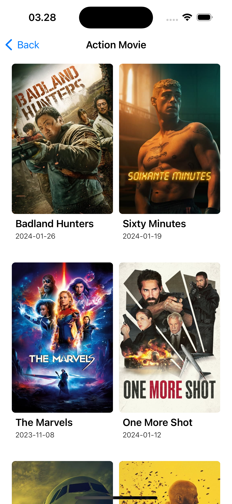

# Makdempu Movie

Makdempu Movie is a simple iOS application that allows users to browse and discover the latest movies. With a clean and simple interface, users can easily find movies they are interested in, view movie details, read reviews, and watch trailers.

## Technologies Used

- **Xcode**: Version 15.2
- **Swift**: Version 5
- **UIKit**
- **VIPER Design Pattern**
- **The Movie Database (TMDB) API**

## Features

- [x] Browse the list of popular movies
- [x] Browse the list of movies by genre
- [x] View movie details, including synopsis, rating, and release date
- [x] Read user reviews about movies
- [x] Watch movie trailers directly within the app

## Screenshot

     
